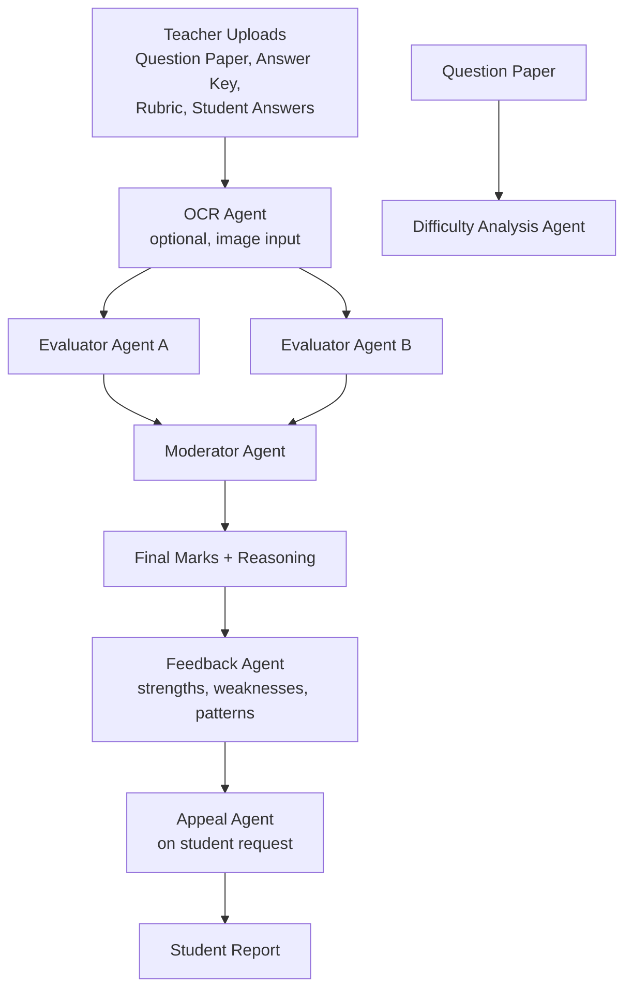

# FairGrade AI

AI-powered examination evaluation system that makes grading transparent, consistent, and fair — explaining every mark, catching recurring mistakes, and supporting student appeals.

## Features
- Dual independent evaluator agents + a moderator agent for fair grading
- Question-wise mark justification (why marks were awarded/deducted)
- Whole-paper mistake pattern analysis
- Personalized feedback and improvement recommendations
- Question paper difficulty analysis
- Student appeal / re-evaluation system
- Teacher and Student login views

## System Architecture

## How It Works
1. Teacher pastes/uploads the question paper, answer key, rubric, and student answers
2. Evaluator A and Evaluator B independently grade the paper
3. Moderator Agent reconciles both, sets the final score with reasoning
4. Feedback Agent summarizes strengths, weaknesses, and recurring mistakes
5. Difficulty Agent rates the question paper separately
6. Student can appeal any question; Appeal Agent re-checks and decides

## Tech Stack
Python · Streamlit · Google Gemini API (multi-agent architecture)

## Key Outputs
**Students:** final score, question-wise marks + reasoning, mistake patterns, recommendations, appeal option
**Teachers:** automated dual-checked grading, difficulty analysis, less manual effort

## Future Improvements
Per-user accounts, database, batch grading, analytics dashboard, handwriting-robust OCR

---

## Setup
1. Get a free key at aistudio.google.com/apikey
2. `pip install -r requirements.txt`
3. `streamlit run app.py`

**Deploy as a public webpage (no laptop needed):** push `app.py`, `agents.py`, `ui.py`, `requirements.txt` to a GitHub repo → deploy on share.streamlit.io → add `GEMINI_API_KEY`, `TEACHER_PASSCODE`, `STUDENT_PASSCODE` under Settings → Secrets.

*Note: Teacher/Student logins use a shared passcode per role, not individual accounts — real auth is listed under Future Improvements.*
